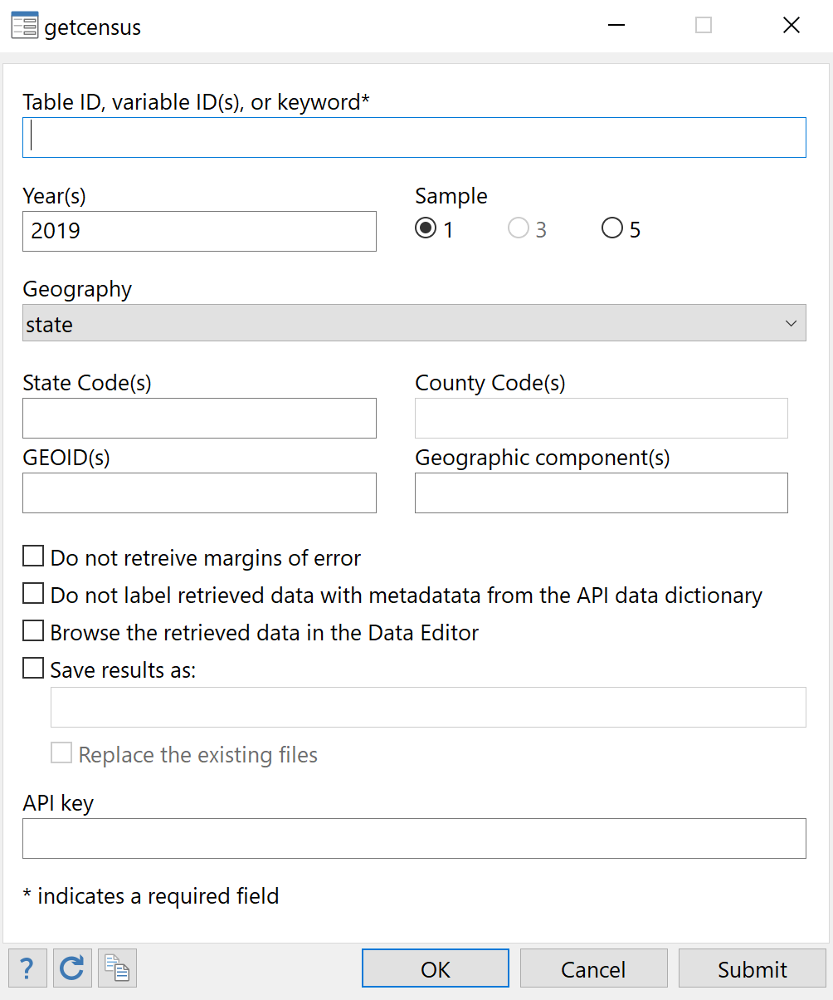

```{r setup, include=FALSE}
knitr::opts_chunk$set(echo = FALSE,
                      message = FALSE)
library(tidyverse)
library(readxl)
library(kableExtra)
```


# Description

**getcensus** is a Stata package for loading American Community Survey (ACS) data from the U.S. Census Bureau API into Stata.

The Census Bureau publishes thousands of data tables on the web at [data.census.gov](https://www.data.cenus.gov). The underlying data is available through the Census Bureau Application Programming Interface (API).[^1] 

[^1]: In fact, data.census.gov is powered by the API.

To obtain data from the API, you will need to know the table ID and variable ID of the data point you are interested in. Each table that the Census Bureau publishes on data.census.gov has a unique table ID, and each data point within a table has a unique variable ID. For instance, table S1701, [Poverty status in the past 12 months](https://data.census.gov/cedsci/table?tid=ACSST1Y2019.S1701&hidePreview=true), contains the estimated number of people in poverty. The variable ID for this data point is S1701_C02_001. 

To retrieve ACS data from the API, users may specify one or more variable IDs, a single table ID, or a [keyword](#keywords) to __getcensus__. If a list of variable IDs is specified, the variables must come from tables that share the same product type (Data Profile, Subject Table, Comparison Profile, or Detailed Table). By default, **getcensus** retrieves both estimates and their margins of error, so users should not suffix variable IDs with "E" (for estimate) or "M" (for margin of error). In the Stata dataset loaded by **getcensus**, the variable names are the ACS variable IDs. Variable labels contain the ACS variable's description and a variable note contains the name of the ACS variable's table. If the option __nolabel__ is specified, this metadata will not be included.

Users rarely know offhand the variable ID or table ID of the data points they would like to retrieve. **getcensus catalog** allows users to access the API data dictionaries. For instance, `getcensus catalog, product(ST)` will load into memory a dataset containing, for every variable in the subject tables ("ST"): the variable ID, the variable's description, and the name of the variable's table.

If you are new to American Community Survey data, the Census Bureau's handbook [Understanding and Using American Community Survey Data: What All Data Users Need to Know](https://www.census.gov/programs-surveys/acs/guidance/handbooks/general.html) is the best place to start.

*getcensus uses the Census Bureau Data API but is not endorsed or certified by the Census Bureau.*


# Getting Started

Install **getcensus** with:

    net install getcensus, from("https://raw.githubusercontent.com/CenterOnBudget/getcensus/master/src") replace


To update your installation of **getcensus** to the latest version, run:

    ado update getcensus, update

A list of changes in each release can be found [here](https://github.com/CenterOnBudget/getcensus/blob/master/NEWS.md).

To use **getcensus**, you will need a Census Bureau API
key. One can be acquired free here: <https://api.census.gov/data/key_signup.html>.

**getcensus** requires Stata version 13.1 or later.


# Syntax

Retrieve ACS data

```
getcensus {variable IDs, table ID, or keyword} [, options]
```
Search the API data dictionary

```
getcensus catalog [, options]
```

## Options

### Main

**<u>year</u>s(**<i>numlist</i>**)** year(s) to retrieve; default is latest available.

**<u>samp</u>le(**<i>integer</i>**)** 1, 3, or 5; default is **sample(1)**.

**<u>geo</u>graphy(**<i>string</i>**)** geography to retrieve, default is **geography(state)**.

**key(**<i>string</i>**)** your Census Bureau API key.

**<u>nolab</u>el(**<i>string</i>**)** do not label variables with associated metadata from the API data dictionary.

**<u>noerr</u>or** do not retrieve margins of error associated with estimates.

**saveas(**<i>filename</i>**)** save retrieved data as a Stata dataset.

**<u>ex</u>portexcel** if **saveas()** is specified, also save retrieved data as an Excel spreadsheet. 

**replace** if **saveas()** is specified, overwrite existing files.

**clear** replace the data in memory, even if the current data have not been saved to disk.

**browse** browse the retrieved data in the Data Editor after **getcensus** completes.

### Geography options

**<u>geoid</u>s(**<i>string</i>**)** GEOIDs of geographies to retrieve; default is usually all.

**<u>st</u>atefips(**<i>string</i>**)** state FIPS codes of states to retrieve; default is usually all.

**<u>co</u>untyfips(**<i>string</i>**)** county FIPS codes of counties to retrieve; default is usually all.

**<u>geocomp</u>onents(**<i>string</i>**)** geographic component codes of geographies to retrieve.

### Catalog options

**<u>pr</u>oduct(**<i>string</i>**)** load the API data dictionary for estimates of given product type.

**<u>t</u>able(**<i>string</i>**)** load the API data dictionary for estimates in a given table.

**search(**<i>string</i>**)** load the API data dictionary for estimates with descriptions matching a search term.

### Advanced options

**<u>cache</u>path(**<i>string</i>**)** customize where **getcensus** caches API data dictionaries.


# Options

## Main

**years(**<i>numlist</i>**)** specifies the years (or endyears, if multiyear estimates are requested) of the sample to be retrieved. Defaults is the latest available year. If multiple years are requested, data for all years requested will be appended together. Users requesting multiple years should be aware that not all ACS estimates are available for all years, and table specifications and geographies may change between years; see [ACS Table & Geography Changes](https://www.census.gov/programs-surveys/acs/technical-documentation/table-and-geography-changes.html) on the Census Bureau website. Users may deviate from _numlist_ conventions and separate ranges with "-" rather than "/" (e.g., "2017-2019" for 2017, 2018 and 2019).

**sample(**<i>integer</i>**)** specifies the sample to retrieve: 1 for 1-year estimates, 3 for 3-year estimates (2012-2013 only), or 5 for 5-year estimates. Default is 1. 1-year estimates are only available for geographic areas with more than 65,000 residents; see [this page](https://www.census.gov/programs-surveys/acs/guidance/estimates.html) on the Census Bureau website.

**geography(**<i>string</i>**)** specifies the geographic unit for which to retrieve data. Default is state. See [Supported Geographies](#supported-geographies).

**key(**<i>string</i>**)** specifies your Census Bureau API key. If you do not have an API key, you may acquire one [here](https://api.census.gov/data/key_signup.html). To avoid specifying **key()** each time **getcensus** is used, store your API key in a global macro named *censuskey* in your profile.do. Learn about where to find your profile.do [here](https://www.stata.com/support/faqs/programming/profile-do-file/). If you are unfamiliar with global macros, simply type `global censuskey "your-api-key-here"` into your profile.do.

**nolabel** specifies that retrieved data should not be labeled with associated metadata from the API data dictionary.

**noerror** specifies that **getcensus** should not retrieve margins of error associated with estimates.

**saveas(**<i>filename</i>**)** causes retrieved data to be saved under the name *filename* as a Stata dataset.

**exportexcel**  if **saveas()** is specified, causes retrieved data to also be exported to an Excel spreadsheet.

**replace** if **saveas()** is specified, allows existing files to be 
overwritten.

**clear** causes the data in memory to be replaced, even if the current data have not been saved to disk.

**browse** opens retrieved data in the Data Editor after **getcensus** completes.

## Geography options

**statefips(**<i>string</i>**)** Two-digit FIPS codes of state(s) to retrieve. Default is usually all. A listing of state FIPS codes can be found [here](https://www.nrcs.usda.gov/wps/portal/nrcs/detail/?cid=nrcs143_013696).

**countyfips(**<i>string</i>**)** Three-digit FIPS codes of counties to retrieve. A list of county FIPS codes by year can be found [here](https://www.census.gov/geographies/reference-files.2019.html) on the Census Bureau website. Note that county FIPS codes may change between years; see [ACS Table & Geography Changes](https://www.census.gov/programs-surveys/acs/technical-documentation/table-and-geography-changes.html) on the Census Bureau website.

**geoids(**<i>string</i>**)** GEOID(s) of geographies to retrieve. Default is usually all. GEOIDs are numeric codes that uniquely identify all geographic areas for which the Census Bureau tabulates data; see [Understanding Geographic Identifiers](https://www.census.gov/programs-surveys/geography/guidance/geo-identifiers.html) on the Census Bureau website. Many geography types have GEOIDs that are made up of several components. Only the last component should be specified in **geoids()**. The state code component of the GEOID should be specified in **statefips()**. If the GEOID includes a county code, it should be specified in **countyfips()**. See [Examples](#examples). Note that GEOIDs and geography definitions may change between years; see [ACS Table & Geography Changes](https://www.census.gov/programs-surveys/acs/technical-documentation/table-and-geography-changes.html) on the Census Bureau website. **getcensus** supports most, but not all, geographies supported by the ACS API; see [Supported Geographies](#supported-geographies).

**geocomponents(**<i>string</i>**)** Geographic component codes of the geographic components to retrieve. Geographic components are division of a geographic unit by certain criteria, such as rural, urban, in metropolitan statistical area, and not in metropolitan statistical area. **getcensus** does not support all geographic components available on the Census Bureau API; see [Supported Geographies](#supported-geographies).

## Catalog options

**product(**<i>string</i>**)** will load the API data dictionary for variables in tables of a given product type, as specified with a two-letter abbreviation. Default is DT. For information about ACS tables and product types, see [this page](https://www.census.gov/programs-surveys/acs/guidance/which-data-tool/table-ids-explained.html) on the Census Bureau website. If both **product()** and **table()** are specified with **getcensus catalog**, **product()** is ignored and the appropriate product type is determined by the contents of **table()**.

```{r}
options(knitr.kable.NA = "")

tribble(
  ~ Abbreviation, ~ `Product type`,
  "DP", "Data Profile",
  "ST", "Subject Table",
  "CP", "Comparison Profile",
  "DT", "Detailed Table") %>%
  kbl() %>%
  kable_styling(position = "left",
                bootstrap_options = "striped",
                full_width = FALSE)
```

**table(**<i>string</i>**)** will load the API data dictionary for a given table. For information about ACS tables and product types, see [this page](https://www.census.gov/programs-surveys/acs/guidance/which-data-tool/table-ids-explained.html) on the Census Bureau website. If both **product()** and **table()** are specified with **getcensus catalog**, **product()** is ignored and the appropriate product type is determined by the contents of **table()**.

**search(**<i>string</i>**)** will load the API data dictionary for variables whose descriptions match a given search term, such as "children", "poverty", or "veteran". A regular expression may be specified to **search()**.

## Advanced options

**cachepath(**<i>string</i>**) getcensus** caches API data dictionaries for future retrieval. By default, these files are saved in application support (`~/AppData/Local/` on Windows and `~/Library/Application Support` on Mac). To save these files elsewhere, pass your desired location to **cachepath()**.


# Supported Geographies

## Geographies

**getcensus** supports most, but not all, geographies supported by the Census Bureau API. Users who are requesting data for multiple years should be aware that ACS geography definitions may change between years; see [ACS Table & Geography Changes](https://www.census.gov/programs-surveys/acs/technical-documentation/table-and-geography-changes.html) on the Census Bureau website.

A list of geographies supported by **getcensus** can be found below. For some geographies, users may specify an abbreviation rather than the full name. The Options column indicates whether **statefips()** or **countyfips()** may be specified with a given geography. **Bold** indicates the option is required with a given geography.

```{r, echo=FALSE}

read_excel("dev/doc_tables.xlsx", sheet = "geographies") %>%
  rename(" " = 1) %>%
  kbl() %>%
  kable_styling(position = "left",
                bootstrap_options = "striped",
                fixed_thead = TRUE) %>%
  footnote(symbol = c("only 5-year estimates are available for this geography",
                      "only 5-year estimates are available when __statefips()__ is specified with this geography"))
```

## Geographic components

Geographic components are division of a geographic unit by certain criteria. **getcensus** does not support all geographic components available on the Census Bureau API.

An example: `getcensus [variable IDs], geography(state) geocomponents(H0 C0)` will return two observations for each state: one for the portion of the state not in a metropolitan statistical area ("H0"), and one for the portion of the state in a metropolitan statistical area ("C0").

```{r, echo=FALSE}
read_excel("dev/doc_tables.xlsx", sheet = "geocomponents") %>%
  rename(" " = 1) %>%
  kbl() %>%
  kable_styling(position = "left",
                bootstrap_options = "striped",
                fixed_thead = TRUE) %>%
  pack_rows("Available with geography() _us_, _region_, _division_, or _state_", 
            1, 12) %>%
  pack_rows("Available with geography(*us*) only", 
            13, 19) %>%
  footnote(symbol = c("only 5-year estimates are available for this geographic component",
                      "1-year estimates are not avaialble for this geographic component"))
```


# Keywords

Users may use a keyword to retrieve a curated set of variables.

```{r}
read_excel("dev/doc_tables.xlsx", sheet = "keywords") %>%
  kbl() %>%
  kable_styling(position = "left",
                bootstrap_options = "striped",
                fixed_thead = TRUE) %>%
  footnote(symbol = c("When using the data retrieved by keyword _costburden_renters_ to compute rates of renter housing cost burden, compute the denominator by subtracting the number of renters for whom cost burden is not computed (B25070_011) from the number of renters (B25070_001). This step is not necessary when using the data returned by keyword _housing_overview_; the total in this table's section on rent burden (DP04_0136) already excludes the number of renters for whom cost burden cannot be computed."))

```


# Examples

## Variables, tables, and keywords

Single table
```
getcensus S2701
```
Single variable
```
getcensus B19013_001
```
Multiple variables from a single table
```
getcensus DP02_0053 DP02_0054 DP02_0055 DP02_0056 DP02_0057
```
Multiple variables from more than one table
```
getcensus S1701_C03_001 S2701_C05_001
```
Keyword
```
getcensus medinc
```
## Years and samples

Single year (default is most recent available)
```
getcensus B19013, year(2010)
```
Multiple years
```
getcensus B19013, years(2018/2019)
getcensus B19013, years(2010 2015 2019)
```
Samples (default is 1)
```
getcensus B19013, sample(5)
getcensus B19013, sample(3) year(2013)
```
## Geographies

Types (default is state)
```
getcensus B19013, geography(us)
getcensus B19013, geography(county)
getcensus B19013, sample(5) geography(sldu) statefips(26)
```
Within a state or set of states
```
getcensus B19013, statefips(11)
getcensus B19013, geography(county) statefips(04)
getcensus B19013, geography(congressional district) statefips(24 51)
getcensus B19013, sample(5) geography(metro) statefips(06)
```
With specific GEOIDs
```
getcensus B19013, geography(metro) geoids(47900)
getcensus B19013, geography(county) statefips(24) geoids(005 510)
getcensus B19013, sample(5) geography(tract) statefips(01) countyfips(001) geoids(020100)
```
Geographic components
```
getcensus B19013, geocomponents(H0)
getcensus B19013, geocomponents(01 43) statefips(13)
getcensus B19013, sample(5) geography(us) geocomponents(92)
```
## Catalog

All variables in tables of a given product type
```
getcensus catalog, product(DP)
```
Variables from a single table
```
getcensus catalog, table(S0901)
```
Variables matching a search term
```
getcensus catalog, search(children) product(ST)
getcensus catalog, search(educational attainment) table(S1701)

```

# Dialog Box

The getcensus dialog box provides full access to the program in an easy-to-use, interactive format. Open the dialog box by typing `getcensus` without arguments, or by typing `db getcensus`. 




# Getting Help

Report a bug by filing an issue on GitHub [here](https://github.com/CenterOnBudget/getcensus/issues) (requires a [free GitHub account](www.github.com/join)). 

[State Priorities Partnership](https://statepriorities.org/state-priorities-partners/) members may email the CBPP Data Team or contact us on on The Loop.


# License

getcensus is made available under the following
[license](https://github.com/CenterOnBudget/getcensus/blob/master/LICENSE):

> Copyright (c) 2020 Center on Budget and Policy Priorities
>
> Permission is hereby granted, free of charge, to members of the State Priorities Partnership network described at <https://statepriorities.org/state-priorities-partners/>, and to all other organizations and individuals granted permission by the Centeron Budget and Policies Priorities, to use copies of this software and associated documentation files (the "Software") without restriction, subject to the following conditions:
>
> The above copyright notice and this permission notice shall be included in all copies or substantial portions of the Software.
>
> The Software is provided "as is", without warranty of any kind, express or implied, including but not limited to the warranties of merchantability, fitness for a particular purpose and noninfringement. In no event shall the authors or copyright holders be liable for any claim, damages or other liability, whether in an action of contract, tort or otherwise, arising from, out of or in connection with the software or the use or other dealings in the Software.


# Contributors

**getcensus** is a project of the [Center on Budget and Policy Priorities](http://www.cbpp.org), a nonpartisan research and policy institute. 


It is developed and maintained by [Claire Zippel](https://www.cbpp.org/about/our-staff/claire-zippel) and [Matt Saenz](https://www.cbpp.org/about/our-staff/matt-saenz). It was created by [Raheem Chaudhry](https://github.com/raheem03) and [Vincent
Palacios](https://github.com/vincentpalacios). Contributors include: [Lori Zakalik](https://github.com/lzak88).


# Related

The [**censusapi**](https://ideas.repec.org/c/boc/bocode/s458618.html) Stata package by Jesse Wursten is a simple tool to access the Census Bureau API. Unlike **getcensus**, **censusapi** provides access to all datasets on the API, including decennial census data, population estimates, and more, as well as all geographies and geographic components.

The [**tidycensus**](https://walker-data.com/tidycensus/) R package by Kyle Walker allows users to obtain ACS, decennial census, and population estimates data from the Census Bureau API as tidyverse-ready data frames, optionally with simple feature geometry included. (Recent development of **getcensus**, particularly improvements to its documentation, has been partially inspired by **tidycensus**.)


